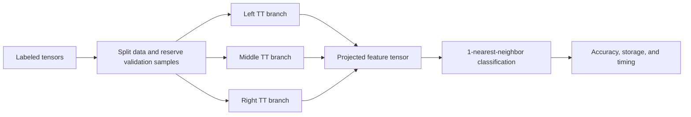

# Multi-Branch Tensor-Train Discriminant Analysis

MATLAB research code for learning compact, discriminative features from tensor-valued observations.

This repository accompanies **Multi-Branch Tensor Network Structure for Tensor-Train Discriminant Analysis**, by Seyyid Emre Sofuoglu and Selin Aviyente. The method learns a tensor-train projection using class labels. Its two- and three-branch variants optimize smaller projected problems, with different tradeoffs between feature storage and training cost.

[Read the paper](https://arxiv.org/abs/1904.06788) · [IEEE publication](https://ieeexplore.ieee.org/abstract/document/9585029) · [Experiments](docs/experiments.md) · [Validation status](docs/validation.md)

> **Status:** The modernization has passed static MATLAB syntax checks. MATLAB tests, the demo, external-toolbox integration, and benchmark reproduction have **not yet been executed**. MATLAB R2024b is the initial validation target.

## Quickstart

You need MATLAB and **Statistics and Machine Learning Toolbox**. The tensor operations and orthogonality solver needed by the demo are bundled.

From the repository directory, in MATLAB:

```matlab
setup_mbttda;
experiment = demo_synthetic();
```

The demo generates small six-mode tensors with a fixed seed and runs TTDA, 2WTTDA, and 3WTTDA. It prints a table containing accuracy, normalized storage, and training time. It does not download data, save results, or launch the full experimental sweep.

To plot the returned results:

```matlab
figures = plot_experiment(experiment);
```

## How the code fits together



This shows the three-branch structure. Each branch is optimized after projecting onto the other branches. TTDA uses one branch; 2WTTDA uses two. Read [the code guide](docs/code-guide.md) for the connection between tensor shapes, paper equations, and MATLAB functions.

| Location | Responsibility |
| --- | --- |
| `src/algorithms` | TTDA variants, comparison methods, and factor optimization |
| `src/tensor` | Contractions, unfolding, decomposition, and scatter matrices |
| `src/data` | Dataset layouts, presets, and reproducible splits |
| `src/experiments` | Configuration, validation, result loading, and summaries |
| `src/plotting` | Shared plots and historical plotting entry points |
| `tests` | Small mathematical, regression, and integration tests |
| `third-party` | Original bundled dependencies and their notices |

## Run an experiment

A short COIL run using its original tensor layout:

```matlab
setup_mbttda;
config = experiment_config('COIL');
config.methods = {'TTDA', 'TWTTDA', 'ThW', 'MPS'};
config.repeats = 1;
config.tau = 0.2;       % Explicitly replace the original multi-value grids.
config.lambda = 1;      % A fixed value bypasses the expensive validation search.
config.output_dir = fullfile(pwd, 'results', 'coil-example');
experiment = run_experiment(config);
disp(experiment.summary);
```

Leave `tau` empty to use each method's original grid. Leave `lambda` empty to run the recorded leave-s-out search. A full sweep is considerably more expensive than the demo.

The historical `mydemo` and `mdademo` commands remain entry points to the full COIL and Weizmann comparison workflows. `mydemo` needs additional external dependencies.

## Available methods

| Configuration name | Implementation | Additional requirements |
| --- | --- | --- |
| `TTDA`, `TWTTDA`, `ThW` | One, two, and three branches | Bundled code; Statistics toolbox |
| `LDA`, `MPS` | Dense LDA and matrix product state baselines | Bundled code; Statistics toolbox |
| `CMDA`, `DGTDA` | Tucker discriminant analysis | Bundled classification code; Statistics toolbox |
| `TTNPE` | Original approximate TT neighborhood embedding | Upstream TTNPE helpers |
| `BTT`, `TWBTT`, `ThWBTT` | Existing block-TT / EVAMEn comparisons | TT-Toolbox, TTeMPS 1.1, LOBPCG |

`2WTTDA` and `3WTTDA` are accepted configuration aliases. STTM appears in the paper but has no implementation in this checkout.

See [dependency setup](docs/dependencies.md). Missing prerequisites produce an error before the sweep starts.

## Datasets

| Dataset | In this checkout? |
| --- | --- |
| COIL-100, COIL3D, MNIST, Weizmann | Yes, as preprocessed MAT files |
| Cambridge, UCF-101 | No; configure a directory containing the original preprocessed files |
| YaleB, GAIT, KTH | Historical presets; their MAT files are not bundled |

[Dataset formats and experiment settings](docs/experiments.md) describe the required arrays, original scaling, incomplete presets, and differences from the paper. Raw-video preprocessing and missing paper baselines are outside this modernization.

## Results and tests

Each run records its parameters, random seed, sample indices, validation folds, and environment information. The paper's **element-count storage ratio** is separate from the historical `Storage` field, which often includes MATLAB container overhead.

```matlab
saved = load_experiment(fullfile(pwd, 'results', 'coil-example'));
plot_experiment(saved);

testResults = runtests('tests', 'IncludeSubfolders', true);
assertSuccess(testResults);
```

Optional external-method tests report explicit skips when dependencies are missing. Core dependency failures are test failures. A prepared GitHub Actions workflow targets MATLAB R2024b on Linux and Windows; it has not been run as part of the local delivery.

Read [behavior changes](docs/changes.md) before comparing results against old MAT files.

## Citation and acknowledgments

Please cite the accompanying paper when using this work. Machine-readable citation information is in [CITATION.cff](CITATION.cff).

```bibtex
@misc{sofuoglu2020multibranch,
  title = {Multi-Branch Tensor Network Structure for Tensor-Train Discriminant Analysis},
  author = {Seyyid Emre Sofuoglu and Selin Aviyente},
  year = {2020},
  eprint = {1904.06788},
  archivePrefix = {arXiv},
  primaryClass = {eess.SP},
  url = {https://arxiv.org/abs/1904.06788v2}
}
```

The original toolbox builds on [TTNPE](https://github.com/wangwenqi1990/TTNPE), FOptM, Tensorlab, TP Toolbox, and [Laura Frølich's tensor classification code](https://github.com/laurafroelich/tensor_classification). BTT comparisons additionally use the TT-Toolbox and TTeMPS work cited in their source files. Existing third-party code and notices are retained; no new repository-wide license has been applied.
